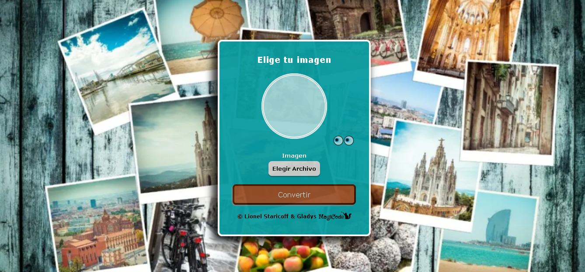
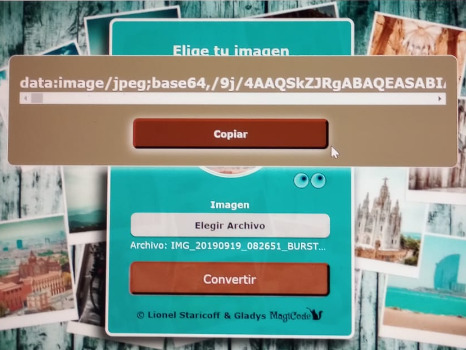

  
# Convertidor de imagen a texto

Esta app te permitirá convertir la imagen a texto y copiar dicho texto, el cual podrás pegar en lugar del archivo de la imagen. 
Por ejemplo:
Background-image: url(" Aquí irá el texto que has copiado del convertidor ");

Link de la app: https://convertirimagenacodigo.netlify.app/

# Conversor de imagenes

  
  
  

